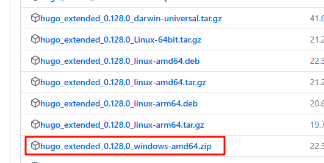
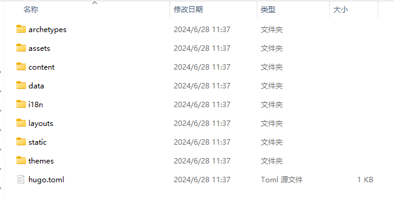
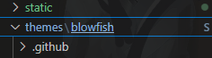
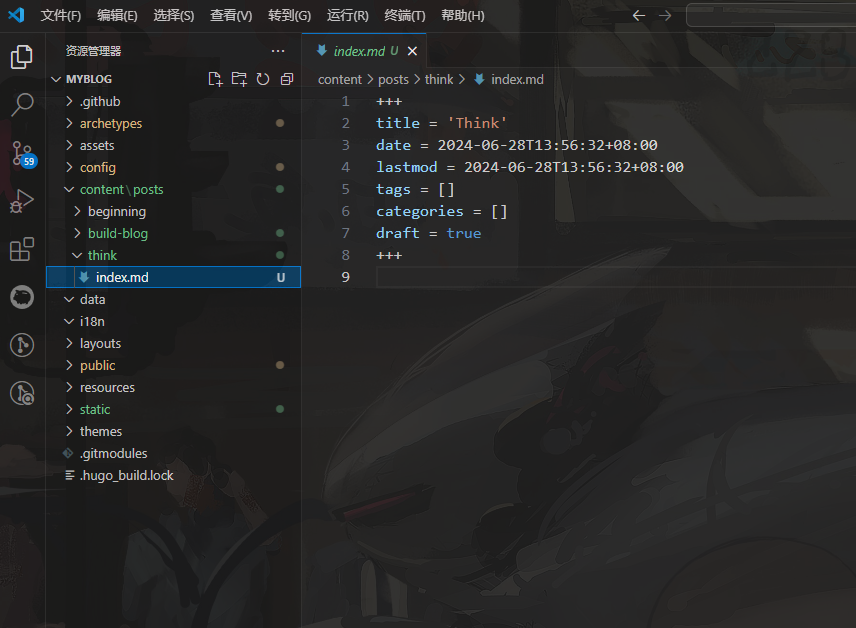
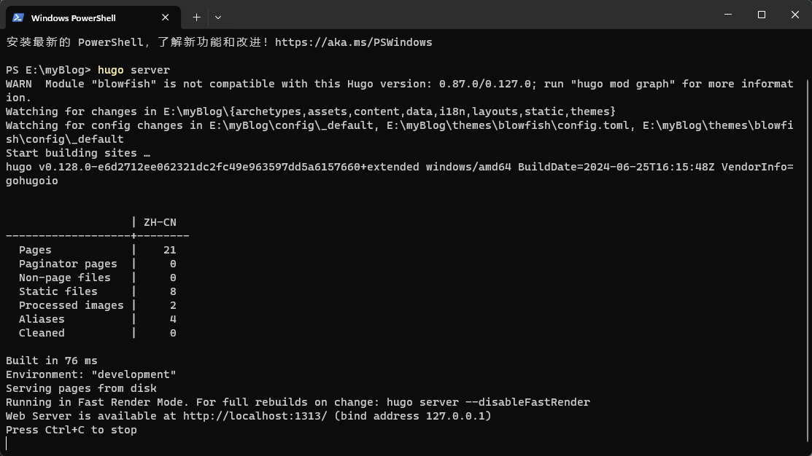
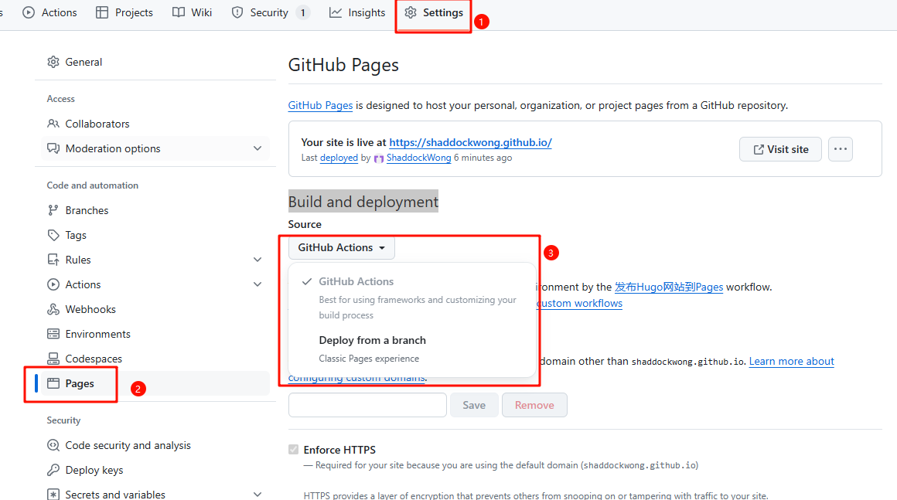

+++
title = '利用 GitHub Pages + Hugo 搭建个人博客'
date = 2024-06-28T09:58:33+08:00
lastmod = 2024-06-28T09:58:33+08:00
tags = ['blog', '网站']
categories = ['博客']
draft = false

+++

## 选型

在 Hexo 和 Hugo 之间纠结了很久，开始尝试使用 Hexo 构建博客，搭建很快，主题很多，生成页面也比较漂亮，但是构建速度慢，外加没有找到自己喜欢的配色。再次尝试使用 Hugo 搭建，构建真快，主题也多，[Blowfish](https://blowfish.page/zh-cn) 主题文档也全，使用体验真的没话说。

## 前置条件

使用 Hugo 前，需要自己安装 [Go](https://golang.google.cn/dl/) 语言，[Node.js](https://nodejs.org/zh-cn/download/package-manager)，[Git](https://git-scm.com/downloads) 等环境。安装很简单，本人是window系统，下载 amd64 位安装包，点点点，安装完成后验证就可以了。

[Hugo](https://github.com/gohugoio/hugo/releases) 的安装需要注意，直接从 github 上下载 releases 版本的压缩包，解压缩后配置环境变量。Hugo 大部分主题都需要一些高级功能，所以直接下载 扩展版。



配置好环境变量后，在 CMD 命令行查看是否安装成功。

``` cmd
hugo version

## 出现如下提示，即为安装成功
hugo v0.128.0-e6d2712ee062321dc2fc49e963597dd5a6157660+extended windows/amd64 BuildDate=2024-06-25T16:15:48Z VendorInfo=gohugoio
```

## 开始搭建

其实 [Hugo 中文文档](https://hugo.opendocs.io/getting-started/quick-start/) 和  [Blowfish 文档](https://blowfish.page/zh-cn/docs/installation/) 已经很详细了，这里简要总结一下:

### 使用 Hugo 构建项目

``` powershell
Hugo new site your-site
# your-site 请自行修改为自己的项目目录
cd your-site
```

> 注意，`Hugo new site` 要求文件夹必须为空，哪怕是有隐藏文件夹也会导致初始化失败。

初始化后目录结构如下：



``` powe
git init
```

> 各位可以先在 GitHub 上新建一个空白仓库，然后 `git clone` 下来。
>
>  `Hugo new site your-site`之后，将 .git 文件夹拷贝到 your-site 文件夹下，这样方便后续代码提交。

### 安装主题

主题我这里使用的是 Blowfish 主题，优点是文档很全，而且文档支持中文，提供了多种主页布局方式和网站配色。我最喜欢的是‘Avocado’这个配色的深色模式，看起来很舒服。

不建议使用 Blowfish-Tools 工具安装，除非你对 Hugo 框架很熟悉，知道每一个步骤都是在干什么，否则，不推荐使用它。

推荐使用 **使用 Git 子模块安装** 主题。

```powershell
git submodule add -b main https://github.com/nunocoracao/blowfish.git themes/blowfish
```

下载好之后，目录 `themes` 中就会多出来一个 `blowfish` 的目录，里边就是主题的默认内容。



### 设置主题的配置文件

在根目录中，删除 Hugo 自动生成的 `hugo.toml` 文件。从目录 `themes/blowfish/config/_default` 中复制 `*.toml` 文件，粘贴到 `config/_default/` 目录中。Hugo 可以将这些配置统一放在一个 toml 文件中，也可以分多个 toml 文件，便于更好的管理。

接着一定要设置 `config/_default/hugo.toml` 中的 `theme = "blowfish"`，这样才能使用对用的主题。

关于 Blowfish 主题如何配置和使用，官网介绍已经很全了，详细内容请查看官网文档：[Blowfish 文档](https://blowfish.page/zh-cn/docs/) 。

接下来只说几个重要的点：

### 自定义网站图标

Blowfish 主题默认的网站图标是一条蓝色的小河豚，我们可以自定义自己喜欢的图标做自己的网站图标。

网站图标资源的位置在 `static/` 文件夹中，名称必须和下面的名称一样。如果使用了[favicon.io](https://favicon.io/)，那么下载下来解压后的文件名和下面是完全一致的，直接拷贝到 `static/` 中即可。

``` tex
static/
├─ android-chrome-192x192.png
├─ android-chrome-512x512.png
├─ apple-touch-icon.png
├─ favicon-16x16.png
├─ favicon-32x32.png
├─ favicon.ico
└─ site.webmanifest
```

### 用 Hugo 创建文章

用 Hugo 创建一篇文章的命令是：

``` powershell
hugo new xxx.md
```

用这个命令创建的 Markdown 文件会套用 `archetypes` 文件夹中的 front matter 模版，在空白处用 Markdown 写入内容。



其中，`draft = true` 代表这篇文章是一个草稿，Hugo 生成页面不会显示草稿，要在主页显示此文章，可以设置 `draft = false` ，或者直接删掉这行。

### 本地调试和预览

在发布到网站前，我们可以在本地预览网站的内容和效果，运行命令：

``` powershell
hugo server
```



启动完成后，在浏览器输入 `http//localhost:1313/` 可以实时预览生成的网站效果。

使用上边的命令后，会发现文档上 `draft = false` 的文章不会显示，需要修改启动参数：

```powershell
hugo server -D
```

这样，草稿文章内容也会显示了。

## 使用 GitHub Page 构建网站

Hugo 提供非常详尽的 [GitHub Pages 部署指引](https://hugo.opendocs.io/hosting-and-deployment/hosting-on-github/)。这里对部署过程做简单梳理：

1. 在 `./.github/workflows/` 中放入 `hugo.yml`；

2. 将本地网站同步到 GitHub 同名仓库；

3. 在仓库设置 `Settings -> Pages` 中选择 `Build and deployment` 选择 `GitHub Actions`,将 Hugo 推送到 GitHub 上时,便会自动构建网页。

   

完成以上步骤，你便可以通过 `https://<your-github-id>.github.io` 访问自己的个人博客。
