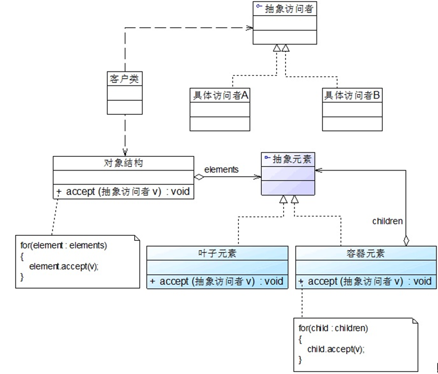

+++
title = '26-访问者模式'
date = 2024-09-12T17:15:00+08:00
lastmod = 2024-09-12T17:15:00+08:00
tags = ['java', '设计模式']
categories = ['Java设计模式']
draft = false

+++

## 访问者模式概述

访问者模式是一种较为复杂的行为型设计模式，它包含访问者和被访问者两个主要组成部分，这些被访问的元素通常具有不同的类型，且不同的访问者可以对他们进行不同的访问操作。例如处方单中的各种药品信息就是被访问的元素，而划价人员和药房工作人员就是访问者。访问者模式使得用户可以在不修改现有系统的情况下扩展系统的功能，为这些不同类型的元素增加新的操作。

在使用访问者模式时，被访问元素通常不是单独存在的，它们存储在一个集合中，这个集合被称为“对象结构”，访问者通过遍历对象结构实现对其中存储的元素的逐个操作。

> **访问者模式**：表示一个作用于某对象结构中的各个元素的操作。访问者模式让用户可以在不改变各元素的类的前提下定义作用于这些元素的新操作。
>
> **Visitor Pattern**：Represent an operation to be performed on the elements of an object structure. Visitor lets you define a new operation without changing the classes of the elements on which it operates.

访问者模式是一种对象行为型模式，它为操作系统不同类型元素的对象结构提供了一种解决方案，用户可以对不同类型的元素施加不同的从操作。

## 访问者模式结构


1. **Visitor（抽象访问者）**：抽象访问者为对象结构中的每一个具体元素类声明一个访问操作，从这个操作的名称或参数类型可以清楚地知道需要访问的具体元素的类型，具体访问者需要实现这些操作方法，定义对这些元素的访问操作。
2. **ConcreteVisitor（具体访问者）**：具体访问者实现了每个由抽象访问者声明的操作，每一个操作用于访问对象结构中一种类型的元素。
3. **Element（抽象元素）**：抽象元素一般是抽象类或者接口，它声明了一个 accept() 方法，用于接受访问者的访问操作，该方法通常以一个抽象访问者作为参数。
4. **ConcreteElement（具体元素）**：具体元素实现了 accept() 方法，在 accept() 方法中调用访问者的访问方法以便完成对一个元素的操作。
5. **ObjectStructure（对象结构）**：对象结构是一个元素的集合，它用于存放元素对象，并且通过了遍历其内部元素的方法。对象结构可以结合组合模式来实现，也可以使一个简单的集合对象。

## 访问者模式实现

在访问者模式中，对象结构存储了不同类型的元素对象，以供不同访问者访问。访问者模式包括两个层次结构：一个是访问者层次结构，提供了抽象访问者和具体访问者；一个是元素层次结构，提供了抽象元素和具体元素。在访问者模式中增加新的访问者无需修改原有系统，系统具有较好的可扩展性。

在访问者模式中，抽象访问者定义了访问元素独享的方法，通常为每一种类型的元素对象都提供一个访问方法，而具体访问者可以实现这些访问方法。如果所有的访问者对某一类型的元素的访问操作都相同，则可以将操作代码移到抽象访问者类中，其典型代码如下：

```java
public abstract class Visitor {
    public abstract void visit(ConcreteElementA elementA);
    public abstract void visit(ConcreteElementB elementB);
    
    public void visit(ConcreteElementC elementC) {
        // 元素 ConcreteElementC 操作代码
    }
}
```

在抽象访问者类 Visitor 的子类 ConcreteVisitor 中实现了抽象的访问方法，用于定义对不同类型元素对象的操作。具体访问者类的典型代码如下：

```java
public class ConcreteVisitor extends Visitor {
    public void visit(ConcreteElementA elementA) {
        // 元素 ConcreteElementA 操作代码
    }
    
    public void visit(ConcreteElementB elementB) {
        // 元素 ConcreteElementB 操作代码
    }
}
```

对于元素类而言，在其中一般都定义了一个 accept() 方法，用于接受访问者的访问。典型的抽象元素类的代码如下：

```java
public interface Element {
    public void accept(Visitor visitor);
}
```

在抽象元素类 Element 的子类中实现了 accept() 方法，用于接受访问者的访问，在具体元素类中还可以定义不同类型的元素所特有的业务方法。其典型代码如下：

```java
public class ConcreteElementA implements Element {
    public void accept(Visitor visitor) {
        visitor.visit(this);
    }
    
    public void operationA() {
        // 业务方法
    }
}
```

在具体元素类 ConcreteElementA 的accept() 方法中，通过调用 Visitor 类的 visit() 方法实现对元素的访问，并以当前对象作为 visit() 方法的参数。其具体执行过程如下：

1. 调用具体元素类的 accept(Visitor visitor) 方法，并将 Visitor 子类对象作为其参数。
2. 在具体元素类 accept(Visitor visitor) 方法内部调用传入 Visitor 对象的 visit() 方法，例如 visit(ConcreteElementA elementA)，将当前具体元素类对象（this）作为参数，例如 visitor，visit(this)。
3. 执行 Visitor 对象的 visit() 方法，在其中还可以调用具体元素对象的业务方法。

这种机制也称为“双重分派”，正因为使用了双重分派机制，使得增加新的访问者无需修改现有类库代码，只需将新的访问者对象作为参数传入具体元素对象的 accept() 方法，程序运行时将回调在新增 Visitor 类中定义的 visiti() 方法，从而增加新的元素访问方式。

在访问者模式中对象结构是一个集合，用于存储元素对象并接受访问者的访问，其典型代码如下：

```java
public class ObjectStructure {
    private ArrayList<Element> list = new ArrayList<Element>(); // 定义一个集合用于存储元素对象
    
    // 接受访问者的访问操作
    public void accept(Visitor visitor) {
        Iterator i = list.iterator();
        
        while(i.hasNext()) {
            ((Element)i.next()).accept(visitor);  // 遍历访问集合中的每一个元素
        }
    }
    
    public void addElement(Element element) {
        list.add(element);
    }
    
    public void removeElement(Element element) {
        list.remove(element);
    }
}
```

在对象结构中可以使用迭代器对存储在集合中的元素对象进行遍历，并逐个调用每一个对象的 accept() 方法，实现对元素对象的访问你操作。

## 访问者模式应用实例

### 实例说明

某公司 OA 系统中包含一个员工信息管理子系统，该公司员工包括正式员工和临时工，每周人力资源部和财务部等部门需要对员工数据进行汇总，汇总数据包括员工工作时间、员工工资等。该公司的基本制度如下：

1. 正式员工每周工作时间为 40 小时，不同级别，不同部门的员工每周基本工资不同；如果超过 40 个小时，超出部分按照 100元/小时作为加班费；如果少于 40 小时，所缺时间按照请假处理，请假所扣工资以 80元/小时计算，知道基本工资扣除到零为止。除了记录实际工作时间外，人力资源部需要记录加班时长或请假时长，作为员工平时表现的一项依据。
2. 临时工每周工作时间不固定，基本工资按小时计算，不同岗位的临时工小时工资不同。人力资源部只需记录实际工作时间。

人力资源部和财务部工作人员可以根据需要对员工数据进行汇总处理，人力资源部负责汇总每周员工工作时间，而财务部负责计算每周员工工资。

现使用访问者模式设计该系统，绘制类图并使用 Java 语言编码实现。

### 实例类图


### 实例代码

1. Employee：员工类，充当抽象元素类。

   ```java
   public interface Employee {
       public void accept(Department handler); // 接受一个抽象访问者访问
   }
   ```

   

2. FulltimeEmployee：全职员工类，充当具体元素类。

   ```java
   public class FulltimeEmployee implements Employee {
       private String name; // 员工姓名
       private double weeklyWage; // 员工周薪
       private int workTime; // 工作时间
   
       public FulltimeEmployee(String name, double weeklyWage, int workTime) {
           this.name = name;
           this.weeklyWage = weeklyWage;
           this.workTime = workTime;
       }
   
       public String getName() {
           return name;
       }
   
       public void setName(String name) {
           this.name = name;
       }
   
       public double getWeeklyWage() {
           return weeklyWage;
       }
   
       public void setWeeklyWage(double weeklyWage) {
           this.weeklyWage = weeklyWage;
       }
   
       public int getWorkTime() {
           return workTime;
       }
   
       public void setWorkTime(int workTime) {
           this.workTime = workTime;
       }
   
       @Override
       public void accept(Department handler) {
           handler.visit(this); // 调用访问者的访问方法
       }
   }
   ```

3. ParttimeEmployee：兼职员工类，充当具体元素类。

   ```java
   public class ParttimeEmployee implements Employee {
       private String name; // 员工姓名
       private double hourWage; // 员工周薪
       private int workTime; // 工作时间
   
       public ParttimeEmployee(String name, double hourWage, int workTime) {
           this.name = name;
           this.hourWage = hourWage;
           this.workTime = workTime;
       }
   
       public String getName() {
           return name;
       }
   
       public void setName(String name) {
           this.name = name;
       }
   
       public double getHourWage() {
           return hourWage;
       }
   
       public void setHourWage(double hourWage) {
           this.hourWage = hourWage;
       }
   
       public int getWorkTime() {
           return workTime;
       }
   
       public void setWorkTime(int workTime) {
           this.workTime = workTime;
       }
   
       @Override
       public void accept(Department handler) {
           handler.visit(this); // 调用访问者的访问方法
       }
   }
   ```

   

4. Department：部门类，充当抽象访问者类。

   ```java
   public abstract class Department {
       // 声明一组重载的访问方法，用于访问不同类型的具体元素
       public abstract void visit(FulltimeEmployee employee);
   
       public abstract void visit(ParttimeEmployee employee);
   }
   ```

   

5. FADepartment：财务部类，充当具体访问者类。

   ```java
   public class FADepartment extends Department {
       // 实现财务部对全职员工的访问
       @Override
       public void visit(FulltimeEmployee employee) {
           int workTime = employee.getWorkTime();
           double weeklyWage = employee.getWeeklyWage();
           if (workTime > 40) {
               weeklyWage = weeklyWage + (workTime - 40) * 100;
           } else if (workTime < 40) {
               weeklyWage = weeklyWage - (40 - workTime) * 80;
               if (weeklyWage < 0) {
                   weeklyWage = 0;
               }
           }
           System.out.println("正式员工" + employee.getName() + "实际工资为：" + weeklyWage + "元。");
       }
   
       // 实现财务部对兼职员工的访问
       @Override
       public void visit(ParttimeEmployee employee) {
           int workTime = employee.getWorkTime();
           double hourWage = employee.getHourWage();
           System.out.println("临时工" + employee.getName() + "实际工资为：" + workTime * hourWage + "元。");
       }
   }
   ```

   

6. HRDepartment：人力资源部类，充当具体访问者类。

   ```java
   public class HRDepartment extends Department {
       // 实现人力资源部对全职员工的访问
       @Override
       public void visit(FulltimeEmployee employee) {
           int workTime = employee.getWorkTime();
           System.out.println("正式员工" + employee.getName() + "实际工作时间为：" + workTime + "小时。");
           if (workTime > 40) {
               System.out.println("正式员工" + employee.getName() + "加班时间为：" + (workTime - 40) + "小时。");
           } else if (workTime < 40) {
               System.out.println("正式员工" + employee.getName() + "请假时间为：" + (40 - workTime) + "小时。");
           }
       }
   
       // 实现人力资源部对兼职员工的访问
       @Override
       public void visit(ParttimeEmployee employee) {
           int workTime = employee.getWorkTime();
           System.out.println("临时工" + employee.getName() + "实现工作时间为：" + workTime + "小时。");
       }
   }
   ```

   

7. EmployeeList：员工列表类，充当对象结构。

   ```java
   public class EmployeeList {
       // 定义一个集合用于存储员工对象
       private ArrayList<Employee> list = new ArrayList<>();
   
       public void addEmployee(Employee employee) {
           list.add(employee);
       }
   
       // 遍历访问员工集合中的每一个员工对象
       public void accept(Department handler) {
           for (Employee employee : list) {
               employee.accept(handler);
           }
       }
   }
   ```

   

8. config.xml：在配置文件中存储了具体访问者的类名。

   ```xml
   <?xml version="1.0" ?>
   <config>
       <className>com.wangyq.visitor.FADepartment</className>
   </config>
   ```

   

9. Client：客户端测试类。

   ```java
   public class client {
       public static void main(String[] args) {
           EmployeeList list = new EmployeeList();
           Employee fte1, fte2, fte3, pte1, pte2;
   
           fte1 = new FulltimeEmployee("张无忌", 3200, 45);
           fte2 = new FulltimeEmployee("杨过", 2000, 40);
           fte3 = new FulltimeEmployee("段誉", 2400, 38);
           pte1 = new ParttimeEmployee("洪七公", 80, 20);
           pte2 = new ParttimeEmployee("郭靖", 60, 18);
   
           list.addEmployee(fte1);
           list.addEmployee(fte2);
           list.addEmployee(fte3);
           list.addEmployee(pte1);
           list.addEmployee(pte2);
   
           Department dep;
           dep = (Department) XMLUtil.getBean("design-pattern/src/main/java/com/wangyq/visitor/config.xml");
           list.accept(dep);
       }
   }
   ```

### 结果及分析

```tex
正式员工张无忌实际工资为：3700.0元。
正式员工杨过实际工资为：2000.0元。
正式员工段誉实际工资为：2240.0元。
临时工洪七公实际工资为：1600.0元。
临时工郭靖实际工资为：1080.0元。
```

如果需要更换具体防卫者类，无需修改源代码。只需修改配置文件即可。

如果要在系统中增加一种新的访问者，无需修改源代码，只要增加一个新的具体访问者即可，在该具体访问者中封装了新的操作元素对象的方法。从增加新的访问者的角度来看，访问者模式符合开闭原则。

## 访问者模式与组合模式连用

在访问者模式中包含一个用于存储元素对象集合的对象结构，通常可以使用迭代器来遍历对象结构，同时具体元素之间可以存在整体与部分关系，有些元素作为容器对象，有些元素作为成员独享，可以使用组合模式来组织元素。引入组合模式后的访问者模式如下图所示：



需要注意的是，在上图的结构中，由于叶子元素的遍历操作已经在容器元素中完成，因此要防止单独已增加到容器元素中的叶子元素再次加入对象结构中，在对象结构中只需保存容器元素和孤立的叶子元素。

## 访问者模式优点

1. 在访问者模式中增加新的访问操作很方便。使用访问者模式，增加新的访问操作就意味着增加一个新的具体访问者类，实现简单，无需修改源代码，符合开闭原则。
2. 访问者模式将有关元素对象的访问行为集中到一个访问者对象中，而不是分散在一个个的元素类中。类的职责更加清晰，有利于对象结构中元素对象的复用，相同的对象结构可以供多个不同的访问者访问。
3. 访问者模式让用户能够在不修改现有元素类层次结构的情况下定义作用于该层次结构的操作。

## 访问者模式缺点

1. 在访问者模式中增加新的元素类很困难。在访问者模式中，每增加一个新的元素类都意味着要在抽象访问者角色中增加一个新的抽象操作，并在每一个具体访问者类中增加相应的具体操作，这违背了开闭原则。
2. 访问者模式破坏了对象的封装性。访问者模式要求访问者对象访问并调用每一个元素对象的操作，这意味着元素对象有时候必须暴漏一些自己的内部操作和内部状态，否则无法供访问者访问。

## 访问者模式适用环境

1. 一个对象结构包含多个类型的对象，希望对这些对象实施一些依赖其具体类型的操作。在访问者中针对每一种具体的类型都提供了一个访问操作，不同类型的对象可以有不同的访问操作。
2. 需要对一个对象结构中的对象进行很多不同的并且不相关的操作，而需要避免让这些操作“污染”这些对象的类，也不希望在增加新操作时修改这些类。访问者模式使得用户可以将相关的访问操作集中起来定义在访问者类中，对象结构可以被多个不同的访问者类所使用，将对象本身与对象的访问操作分离。
3. 对象结构中对象对应的类很少改变，单经常需要在此对象结构上定义新的操作。
