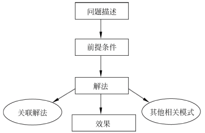

## 设计模式的诞生与发展

### 模式的诞生与定义

模式（Pattern）起源于建筑业而非软件业，模式之父 – Christopher Alexander 博士。

> 模式是在特定环境下人们解决某类重复出现问题的一套成功或有效的解决方案.
>
> A pattern is a successful or efficient solution to a recurring problem within a context.

当一个领域逐渐成熟的时候自然会有很多模式。模式是一种直到，在一个良好的指导下有助于设计一个优良的解决方案，达到事半功倍的效果，而且会的到解决问题的最佳办法。

最早将模式的思想引入软件工程学的是 1991-1992 年以“四人组”（Gang of Four，GOF，分别是 Erich Gamma、Richard helm、Ralph Johnson 和 John Vlissides）自称的 4 位著名软件工程学者。

GoF 将模式的概念引入软件工程领域，这标志着软件模式的诞生。

软件模式并非仅仅限于设计模式，还包括架构模式、分析模式和过程模式等。

软件模式是在一定条件下的软件开发问题及其解法。软件模式的基本结构由 4 个部分构成，即问题描述、前提条件（环境或约束条件）、解法和效果，如下图所示。

### 设计模式的定义与分类

#### 设计模式的定义

设计模式（Design Pattern）是一套被反复使用的、多数人知晓的、经过分类编目的、代码设计经验的总结。使用设计模式是为了可重用代码、让代码更容易被他人理解并且提高代码的可靠性。

GoF 对设计模式的定义如下：

> **设计模式**是在特定环境下为解决某一通用软件设计问题提供的一套定值的解决方案，该方案描述了对象和类之间的相互作用。
>
> **Design patterns** are descriptions of communicating objects and classes that are customized to solve a general design problem in a particular context.

设计模式一般包含模式名称、问题、目的、解决方案、效果、实例代码和相关设计模式，其中的关键元素有以下 4 个。

1. 模式名称（Pattern Name）

   通过一两个词来描述模式的问题、解决方案和效果，以便更好地理解模式并方便开发人员之间的交流，绝大多数模式都是根据其功能或模式结构来命名的。

2. 问题（Problem）

   问题描述了应该在何时使用模式，它包含了设计中存在的问题以及问题存在的原因。在对问题进行描述的同时实际上就确定了模式所对应的使用环境以及模式的使用动机。

3. 解决方案（Solution）

   结局方案描述了设计模式的组成成分，以及这些组成成分的相互关系、各自的职责和协作方式。不针对具体问题，使用抽象描述和怎样用一个具有一般意义的元素组合（类或对象组合）来解决这个问题。

4. 效果（Consequences）

   效果描述了模式应用的效果以及在使用模式时应权衡的问题。没有一个解决方案是百分之百完美的，在使用设计模式时需要进行合理的评价和选择。

#### 设计模式的分类

设计模式一般有两种分类方式：

1. 根据目的分类

   分为创建型（Creational）、结构型（Structural）和行为型（Behavioral）三类。

2. 根据范围分类

   分为类模式和对象模式两种。

## GoF 设计模式简介

### GoF 的 23 种模式一览表

| 范围/目的 |                创建型模式                 |                          结构型模式                          |                          行为型模式                          |
| :-------: | :---------------------------------------: | :----------------------------------------------------------: | :----------------------------------------------------------: |
|  类模式   |               工厂方法模式                |                       （类）适配器模式                       |                   解释器模式 模板方法模式                    |
| 对象模式  | 抽象工厂模式   建造者模式   原型模式  单例模式 | （对象）适配器模式   桥接模式   组合模式   装饰模式   外观模式   享元模式   代理模式 | 职责链模式   命令模式   迭代器模式   中介者模式   备忘录模式   观察者模式   状态模式   策略模式   访问者模式 |

### GoF 的 23 种设计模式的简要说明

| 模式类别                          | 模式名称                                      | 模式说明                                                     |
| --------------------------------- | --------------------------------------------- | ------------------------------------------------------------ |
| 创建型模式（Creational Patterns） | 抽象工厂模式（Abstract Factory Pattern）      | 提供一个创建一系列相关或相互依赖对象的接口，而无需指定它们具体的类 |
|                                   | 建造者模式（Builder Pattern）                 | 将一个复杂对象的构建与它的表示分离，使得同样得构建过程可以创建不同的表示 |
|                                   | 工厂方法模式（Factory Method Pattern）        | 定义一个用于创建对象的接口，但是让子类决定将哪一个类实例化。工厂方法模式让一个类的实例化延迟到其子类 |
|                                   | 原型模式（Prototype Pattern）                 | 使用原型实例指定待创建对象的类型，并且通过复制这个原型来后创建新的对象 |
|                                   | 单例模式（Singleton Pattern）                 | 确保一个类只有一个实例，并提供一个全局访问点来访问这个唯一实例 |
| 结构型模式（Structural Patterns） | 适配器模式（Adapter Pattern）                 | 将一个类的接口转换成客户希望的另一个接口。适配器模式让那些接口不兼容的类可以一起工作 |
|                                   | 桥接模式（Bridge Pattern）                    | 将抽象部分与它的实例部分解耦，使得两者都能够独立变化         |
|                                   | 组合模式（Composite Pattern）                 | 组合多个对象形成树形结构以表示具有部分-整体关系的层次结构。组合模式让客户端可以统一对待单个对象和组合对象 |
|                                   | 装饰模式（Decorator Pattern）                 | 动态地给一个对象增加一些额外的职责。就扩展功能而言，装饰模式提供一种比使用子类更加灵活的替代方案 |
|                                   | 外观模式（Façade Pattern）                    | 为子系统中的一组接口提供一个统一的入口。外观模式定义了一个高层接口，这个接口使得这一子系统更加容易使用 |
|                                   | 享元模式（Flyweight Pattern）                 | 运用共享技术有效地支持大量细粒度对象的复用                   |
|                                   | 代理模式（Proxy Pattern）                     | 给某一个对象提供一个代理或占位符，并由代理对象来控制对原对象的访问 |
| 行为型模式（Behavioral Patterns） | 职责链模式（Chain of Responsibility Pattern） | 避免将一个请求的发送者与接收者耦合在一起，让多个对象都有机会处理请求。将接收请求的对象连接成一条链，并且沿着这条链传递请求，直到有一个对象能够处理它为止 |
|                                   | 命令模式（Command Pattern）                   | 将一个请求封装为一个对象，从而可用不同的请求对客户进行参数化，对请求排队或者记录请求日志，以及支持可撤销的操作 |
|                                   | 解释器模式（Interpreter Pattern）             | 给定一个语言，定义它的文法的一种表示，并给定一个解释器，这个解释器使用该表示来解释语言中的句子 |
|                                   | 迭代器模式（Iterator Pattern）                | 提供一种方法顺序访问一个聚合对象中的各个元素，而又不用暴露该对象的内部表示 |
|                                   | 中介者模式（Mediator Pattern）                | 定义一个对象来封装一系列对象的交互，中介者模式使各对象之间不需要显示地相互引用，从而使其耦合松散，而且可以独立地改变它们之间的交互 |
|                                   | 备忘录模式（Memento Pattern）                 | 在不破坏封装的前提下捕获一个对象的内部状态，并在该对象之外保存这个状态，这样可以将对象恢复到原先保存的状态 |
|                                   | 观察者模式（Observer Pattern）                | 定义对象直接按的一种一对多依赖关系，使得每当一个对象状态发生改变时其相关依赖对象皆得到通知被自动更新 |
|                                   | 状态模式（State Pattern）                     | 允许一个对象在其内部状态改变时改变它的行为。对象看起来似乎修改了它的类 |
|                                   | 策略模式（Strategy Pattern）                  | 定义一系列算法，将每一个算法封装起来，并让它们可以相互替换。策略模式让算法可以独立于使用它的客户而变化 |
|                                   | 模板方式模式（Template Method Pattern）       | 定义一个操作中算法的框架，而将一些步骤延迟到子类中。模板方法模式使得子类可以不改变一个算法的结构即可重定义该算法的某些特定步骤 |
|                                   | 访问者模式（Visitor Pattern）                 | 表示一个作用与某对象结构中的各个元素的操作。访问者模式可以在不改变各元素的类的前提下定义作用于这些元素的新操作 |

## 设计模式的优点

1. 设计模式融合了众多专家的经验，并以一种标准的形式供广大开发人员所用，它提供了一套通用的设计词汇和一种通用的语言以方便开发人员之间沟通和交流，使得设计方案更加通俗易懂。
2. 设计模式使人们可以更加简单、方便地复用成功的设计和体系结构，将已证实的技术表述成设计模式也会使新系统开发者更加容易理解其设计思路。
3. 设计模式使得设计方案更加灵活，且易于修改。
4. 设计模式的使用将提高软件系统的开发效率和软件质量，并且在一定程度上节约设计成本。
5. 设计模式有助于初学者更深入地理解面向对象思想，一方面可以帮助初学者更加方便地阅读和学习现有类库与其他系统中的源代码，另一方面还可以提高软件的设计水平和代码质量。